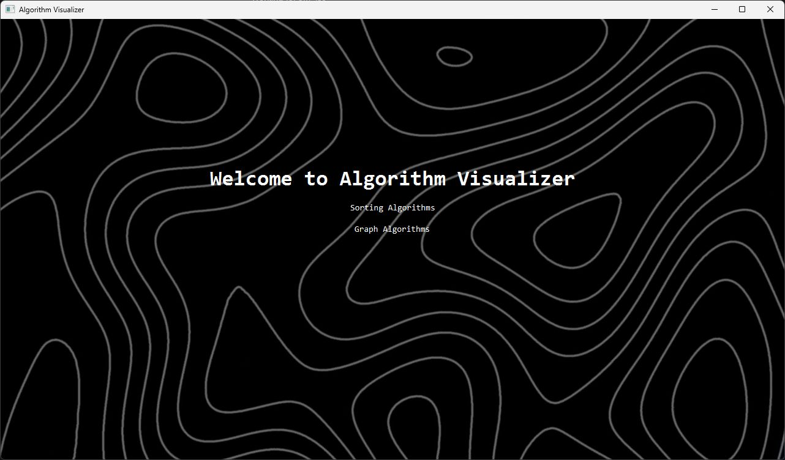
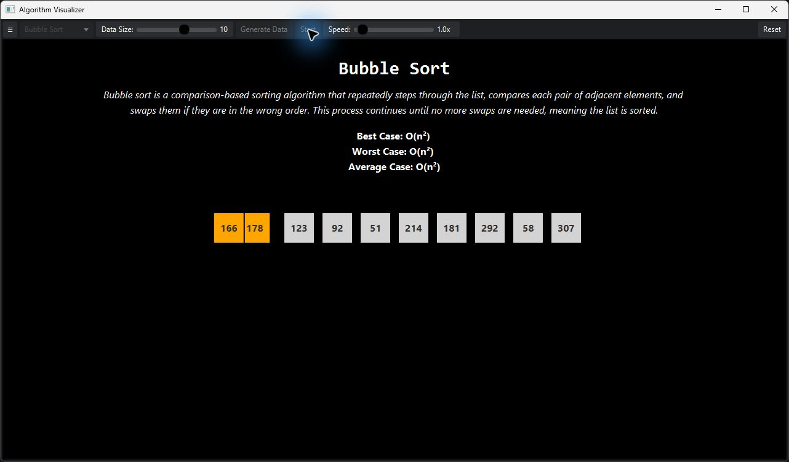
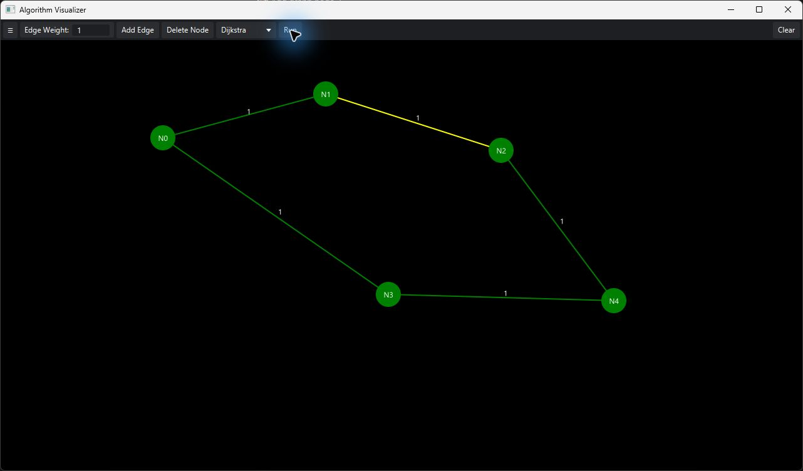

# Algorithm Visualizer

An interactive desktop application for exploring sorting and graph algorithms through step-by-step JavaFX animations.

Built with Java 21, JavaFX, FXML, CSS, and Maven, the application combines algorithm implementations with an interactive interface that makes comparisons, swaps, traversals, edge relaxation, and shortest-path construction visible.

## Screenshots

### Home



### Sorting visualization

Bubble Sort highlighting the pair currently being compared:



### Graph visualization

Dijkstra's algorithm constructing a shortest-path tree on an interactively created graph:



## Supported algorithms

| Category | Algorithms |
| --- | --- |
| Sorting | Bubble Sort, Selection Sort, Insertion Sort, Merge Sort |
| Graph traversal | Breadth-First Search (BFS), Depth-First Search (DFS) |
| Shortest path | Dijkstra's algorithm |

## Features

- Generate randomized arrays with an adjustable data size.
- Control sorting-animation playback speed.
- View algorithm descriptions and best-, average-, and worst-case time complexities.
- Follow color-coded comparisons, swaps, completion states, graph traversal, backtracking, and edge relaxation.
- Create graph nodes by clicking anywhere on the canvas.
- Connect selected nodes with weighted, undirected edges.
- Delete selected nodes or clear the entire graph.
- Choose a starting node and animate BFS, DFS, or Dijkstra.
- Navigate between the animated home screen, sorting visualizer, and graph editor.

## How it works

### Sorting visualizer

The sorting implementations inherit reusable comparison, swap, completion, and speed-control behavior from a shared abstract `Sorting` class. Algorithms run on background threads while UI changes are scheduled on the JavaFX Application Thread with `Platform.runLater`. `CountDownLatch`, `ParallelTransition`, and `TranslateTransition` keep the algorithm state synchronized with each animation.

Merge Sort also visualizes its recursive divide-and-merge process by creating temporary UI nodes for each level.

### Graph visualizer

The graph editor uses an adjacency-list model with reusable node and edge classes.

- **BFS** uses a queue and visited set.
- **DFS** uses recursive traversal and backtracking.
- **Dijkstra** uses a priority queue, distance map, parent-edge map, and edge relaxation.

JavaFX `Timeline` and `KeyFrame` sequences display algorithm progress by changing node and edge colors at each step.

## Tech stack

- Java 21
- JavaFX 21
- FXML and CSS
- Maven and Maven Wrapper
- JUnit 5 dependencies

## Getting started

### Prerequisites

- JDK 21
- Git

Maven does not need to be installed separately because the repository includes the Maven Wrapper.

### Clone and run

```bash
git clone https://github.com/tahmidWasif/algorithm-visualizer.git
cd algorithm-visualizer
```

On Windows:

```powershell
.\mvnw.cmd javafx:run
```

On macOS or Linux:

```bash
./mvnw javafx:run
```

The first launch may take longer while Maven downloads the JavaFX dependencies.

### Build verification

On Windows:

```powershell
.\mvnw.cmd test
```

On macOS or Linux:

```bash
./mvnw test
```

## Using the application

### Visualize a sorting algorithm

1. Open **Sorting Algorithms** from the home screen.
2. Select an algorithm from the drop-down menu.
3. Adjust the data size and click **Generate Data**.
4. Adjust the playback speed if desired.
5. Click **Start** to run the visualization.
6. Use **Reset** to stop the current run and restore the controls.

### Visualize a graph algorithm

1. Open **Graph Algorithms** from the home screen.
2. Click empty areas of the canvas to create nodes.
3. Click two nodes to select them; the first becomes green and the second red.
4. Enter an edge weight and click **Add Edge**.
5. Repeat until the graph is complete.
6. Select the desired starting node.
7. Choose BFS, DFS, or Dijkstra and click **Run**.

## Project structure

```text
src/main/
├── java/
│   ├── com/visualizer/algorithmvisualizer/
│   │   ├── Main.java
│   │   ├── MainController.java
│   │   ├── SortingController.java
│   │   ├── GraphController.java
│   │   ├── sorting/
│   │   │   ├── Sorting.java
│   │   │   ├── BubbleSort.java
│   │   │   ├── SelectionSort.java
│   │   │   ├── InsertionSort.java
│   │   │   └── MergeSort.java
│   │   └── graph/
│   │       ├── Graph.java
│   │       ├── AdjacencyListGraph.java
│   │       ├── GraphNode.java
│   │       ├── GraphEdge.java
│   │       ├── Bfs.java
│   │       ├── Dfs.java
│   │       └── Dijkstra.java
│   └── module-info.java
└── resources/com/visualizer/algorithmvisualizer/
    ├── main-view.fxml
    ├── sorting-view.fxml
    ├── graph-view.fxml
    └── styles.css
```

## Contributors

Developed as a collaborative Java and data-structures project.
